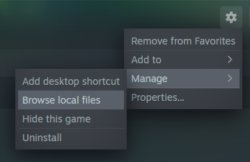

# Voidbound Mods

## Backups
__WARNING__: It is highly recommended to backup your character and worlds folders prior to tinkering with mods, including installing this zip.

1. navigate to `C:\Users\<Your Username>\AppData\LocalLow\IronGate\Valheim` (or in the finder, type `%APPDATA%`, hit ENTER and then go up one folder. You will be in AppData folder. navigate to `LocalLow\IronGate\Valheim` from there).
1. There will be folders named `characters` and `worlds`. Make a copy of these (or just the files within them) somewhere on your computer to restore to in case something goes wrong.
 
## Installation
These are the mods one should use when connecting to the voidbound server. 

1. Ensure the Valheim game is not running
1. In steam, navigate to Valheim. Click the configuration cog > Manage > Browse local files. This will open a folder similar to `C:\SteamLibrary\steamapps\common\Valheim`  

1. [Download the zip](https://github.com/schtauffen/voidbound-valheim/releases/download/v1.1.0/Voidbound-Valheim-Mods.zip) to this folder and unzip it to this location. It should add several folders including `BepInEx` and `unstripped_corlib`
1. Start Valheim! There should be a quick connect option for the Voidbound server in the top left corner. You must make a new character for playing on the server.

## Required Mods
While all might not technically be required, I'm not sure of the compatability of your client _not_ running the following list. For best results you should have them installed.

This zip includes these mods which will match what the server is running. You could also install these manually or through a manager:

1. [BepInEx](https://valheim.thunderstore.io/package/denikson/BepInExPack_Valheim/)
1. [ValheimPlus](https://www.nexusmods.com/valheim/mods/4)
1. [Jotunn](https://www.nexusmods.com/valheim/mods/1138)
1. [ValheimRAFT](https://www.nexusmods.com/valheim/mods/1136)
1. [ServerCharacters](https://valheim.thunderstore.io/package/Smoothbrain/ServerCharacters/)
1. [Odin Campsite](https://www.nexusmods.com/valheim/mods/1765)
1. [Equipment and Quick Slots](https://www.nexusmods.com/valheim/mods/92)
1. [TargetPortal](https://valheim.thunderstore.io/package/Smoothbrain/TargetPortal/)

## Optional Mods
These are purely optional quality of life mods. They are installed and configured with the zip installation.

1. [Quick Connect](https://www.nexusmods.com/valheim/mods/193) - this adds a quick connect interface for connecting to servers.
